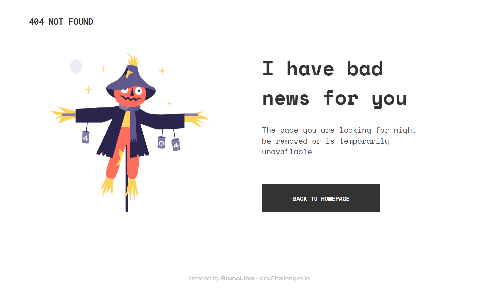

<!-- Please update value in the {}  -->

<h1 align="center">404 Not Found Page</h1>

   Solution for a challenge from  <a href="http://devchallenges.io" target="_blank">Devchallenges.io</a>.

  <h3>
    <a href="hhttps://404-page-kohl.vercel.app/">
      Demo
    </a>
     | 
    <a href="https://{your-url-to-the-solution}">
      Solution
    </a>
     | 
    <a href="https://devchallenges.io/challenges/wBunSb7FPrIepJZAg0sY">
      Challenge
    </a>
  </h3>

<!-- TABLE OF CONTENTS -->

## Table of Contents

- [Overview](#overview)
  - [Built With](#built-with)
- [Features](#features)
- [Contact](#contact)
- [Acknowledgements](#acknowledgements)

<!-- OVERVIEW -->

## Overview

- Where can I see your demo?

      You can see it in Vercel deploy and in my DevChallenges profile.

- What was your experience?

      It was my first time on the DevChallenges plataform and for an easy level challenge it was also a good way to practice quick styling of a simple page.

- What have you learned/improved?

      I tried to develop using semantic tags and mobile first concept, something 100% responsive with breakpoints for medium and large screens.

### Built With

- [CSS](https://developer.mozilla.org/pt-BR/docs/Web/CSS)
- [HTML](https://developer.mozilla.org/pt-BR/docs/Web/HTML)

## Features

This application/site was created as a submission to a [DevChallenges](https://devchallenges.io/challenges) challenge. The [challenge](https://devchallenges.io/challenges/wBunSb7FPrIepJZAg0sY) was to build an application to complete the given user stories.

## Acknowledgements

- [Steps to replicate a design with only HTML and CSS](https://devchallenges-blogs.web.app/how-to-replicate-design/)
- [Figma](https://www.figma.com/)
- [Marked - a markdown parser](https://github.com/chjj/marked)

## Contact

- Website [Portfolio](https://brunolima-portfolio.vercel.app/)
- GitHub [@ybrunolyma](https://github.com/brunolyma)
